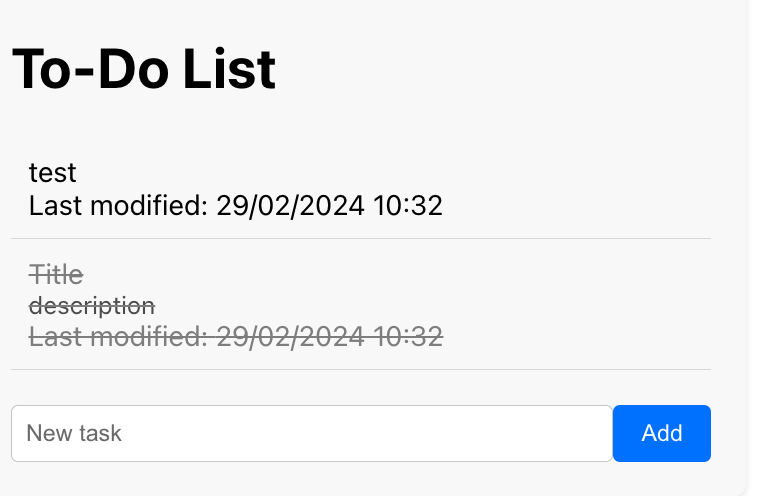

## Ejercicio

Lista de Tareas (To-Do List)

1. Visualizar Todas las Tareas

- Crea un componente que muestre la lista de tareas.
-Cada tarea debe mostrar:
  - Título: El título de la tarea.
  - Descripción (si existe): Detalles adicionales sobre la tarea.
  - Última Modificación: La fecha y hora de la última modificación en el formato (dd - mm - yyyy hh:mm).
- Junto a cada tarea, muestra un icono:
  - ✅ si la tarea está completada.
  - ❌ si la tarea no está completada.
- Inicialmente, la lista debe cargar la información de las tareas desde la ruta “http://localhost:3001”.

- Utiliza el estado (useState) para almacenar la información.
- Utiliza useEffect para cargar los datos en la primera carga de la página.

2. Agregar una Nueva Tarea

- Implementa un formulario para crear una nueva tarea.
- El formulario debe tener los siguientes campos:
  - Título: Obligatorio para la nueva tarea.
  - Descripción: Opcional (puede estar vacío).
- Al hacer clic en el botón “Agregar”, realiza una llamada POST a “http://localhost:3001” con el cuerpo (body) que incluya el título y la descripción.
- La nueva tarea debe agregarse automáticamente a la lista de tareas.

3. Marcar Tareas como Completadas

- Junto a cada tarea, agrega un botón para marcarla como completada.
- Al hacer clic en el botón, envía una llamada PUT a la ruta “http://localhost:3001/:id”.

- La actualización debe reflejarse automáticamente en la lista.

4. Eliminar Tarea

- Añade un botón a cada elemento de la lista para eliminar la tarea.
- El botón debe estar desactivado si la tarea no está completada.
- Al hacer clic en el botón, envía una llamada DELETE a la ruta “http://localhost:3001/:id”.

- La lista de tareas debe actualizarse automáticamente una vez que se eliminar una tarea.

## Antes de empezar

Tenemos un back en node en la carpeta server, para correrlo es necesario tener instalado node y npm.

```bash
cd server
npm install
npm run seed
npm start
```

`npm run seed` es para cargar las tareas iniciales.


## Imagen de ejemplo

